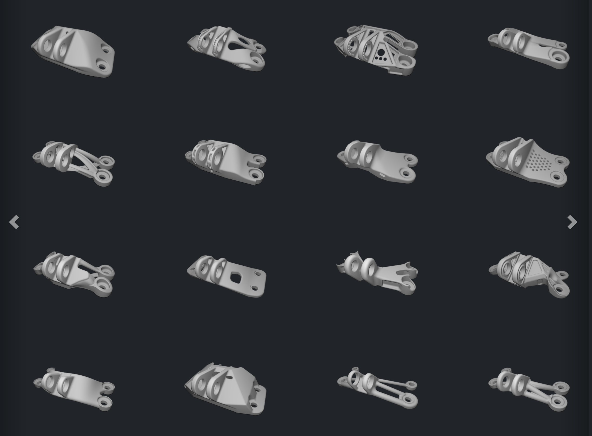

# Structural Design Exploration
CAD and Machine Learning Possibilities

Ashley Hartwell  
Bryan Wen Xi Ong  
Eamon Whalen 
6.859 Interactive Data Visualization 
May 19, 2021 

[Try the Visualization](https://6859-sp21.github.io/final-project-structural_design_exploration/)  
[Final Report](https://docs.google.com/document/d/1oNeSM8zf2lmE1hdvTT-8jw6LCKGyztRjKmZ7nFZ6P-g/edit?usp=sharing)  
[Video Demo](https://www.dropbox.com/s/fpdjqfxhxqbt20d/Structural%20Design%20Explorer_Trim.mp4?dl=0)

## Abstract
As we consider the impact of material usage on climate change, socially responsible engineers need to create products that use less material without sacrificing performance. Parallel to this, the rising capability of machine learning has allowed it to be a powerful tool to produce effienct structural designs across a variety of objectives. Here is an exploration of a CAD dataset by the GE Jet Engine Bracket design competition. It reflects diverse, realistic and complex designs produced by contestants. The performace of these design across a variety of structural and material efficiency metrics has been quantified by Whalen, Beyene and Mueller in order to further the use of machine learning in application-focused contexts.

## Design Rationale
### Overall visualization concept and goals
1. Extract design insights the large geometric and 3D structural simulated dataset  
2. Discover relationships between shape and structural performance prior to download  
3. Explore the geometric variety that exists in the crowdsourced design data

### User Home Page
Upon loading the visualization the user is taken to the home landing page. Becasuse this dataset was one based on academic research vs current events, the home page was designed to give the audience an overview of what this bracket dataset is and how it can be useful. The goal was met through the "CAD and Machine Learning" section on the cover page. The "Start Exploring" section gives users a summary of the two main visualizations they can view and what information and data interactions can be expected from each section. Lastly the title page bar has links to the original design competition where these brackets were created, the published paper that contains information on the computational experiments conducted to get the data shown in the data view visualization, and a link to download the data. This is designed for people who want to learn more inforthat is outside of the scope of the introduction, or want to download and play with the data themselves. 

### Carousel View
The Carousel View aims to allow users to explore the geometric variety that exists in the crowdsourced design data set. To do so, we decided on a carousel format which showcases as many designs on one page as possible, taking into account the extent in which each image can be discerned by the user. We found that number to be 12 images, 4 on each of the 3 rows. The carousel was developed with the help of Bootstrap css style framework. All 381 images were uploaded. Loops were used to iterate through the images and pick out ones that had png files associated with them, as the design names were not in chronological order. Each page is preset to change to the next page after a short period of time to allow the user to get a cursory feel of the entire dataset. A hover-over function was also implemented which slightly grayed out the overlayed image and printed the original designer's name. Upon clicking the image, the tool will navigate the user to the upload page of the original model made by the designer.

### Data View
The Data View aims to allow users to explore the data in a more quantitatitve manner and to directly tie the simulation results for metrics of interests such as mass, surface area, max displacment, and max stress to the geometric profile of the data. The data was displayed on a biobjective scatterplot. This is pretty common in deisgn optimization to help evaluate which designs perform the best with respect to one another and the metrics on interest. For the scatter plot the bracket designs were placed in design categories based on typologies and this was encoded on the scatterplot via discrete colors. The legend on the plot not gives users a key to help separate out the design inthis fashion but the legend is interactive. Users can click the categories on the legend and non-selected data points will be grayed out while the selected category or categories will remain highlighted in their respective color. This helps users understand clustering of data, filter by desired design category, or reveal trends of clustering by category if present. Users also have the option to generate custom scatter plots by choosing which aspect of the data they would like on the x and the y axis via drop downs. Orginally we had every category in our data table available to users, but filtered it down to show the most common metrics of interest and to rid the drop down of categories such as bracket id number that didn’t make logical sense to plot. Lastly upon hovering over a point a tooltip of a miniature bracket that corresponds to the data point shows up. This allows users to quickly see what the designs look like with respect to performance and quickly look at the designs plotted. This was all implemented using d3.js. When a user is ready to commit to a new design they can click the point and it loads the design in the 3D viewer which allows the user to manipulate and image from and stl file of the selected bracket. This was important as the designs sometimes have intricate details along other rotational axis that aren’t immediately apparent in the static image view. This was implemented using three.js

## Work Division
### Data Exploration and Processing
(Eamon) This work was based on a recently published paper by Whalen et. al. which gave meant alot of the initial data insights, exploration of the dataset and cleaning was done by the authors of that work including Eamon! 

### Home Page/File Structure
(Ashley)

### Carousel View
(Bryan)

### Data View
(Eamon) Scatterplot, 3D Viewer, interactive Axes, tooltips
 
(Ashley) Legend Filter

### Visual Design
(All)

## Inspiration and Acknowledgements
We would like to thank our Professor Arvind Satyanarayan as well as the teaching staff, Katie Bacher, Doğa Doğan, Saadiyah Husnoo and Ebenezer Sefah (EJ) for their support this semester and help with implementing our final project!

### Source of Data: 
[Brackets generated for GE design competition](https://grabcad.com/challenges/ge-jet-engine-bracket-challenge)  
[Visualization based on findings from Whalen et al.](https://arxiv.org/abs/2105.03534)  
[Full data set hosted permanently on Harvard Dataverse](https://dataverse.harvard.edu/dataset.xhtml?persistentId=doi:10.7910/DVN/XFUWJG)

### Visualization Sources: 
Work modifies of Bootstrap "cover" template: https://getbootstrap.com/docs/4.0/examples/cover/  
Interactive Legend: https://observablehq.com/@uwdata/introduction-to-d3-part-2  
Interactive 3D graphics: https://threejs.org/

